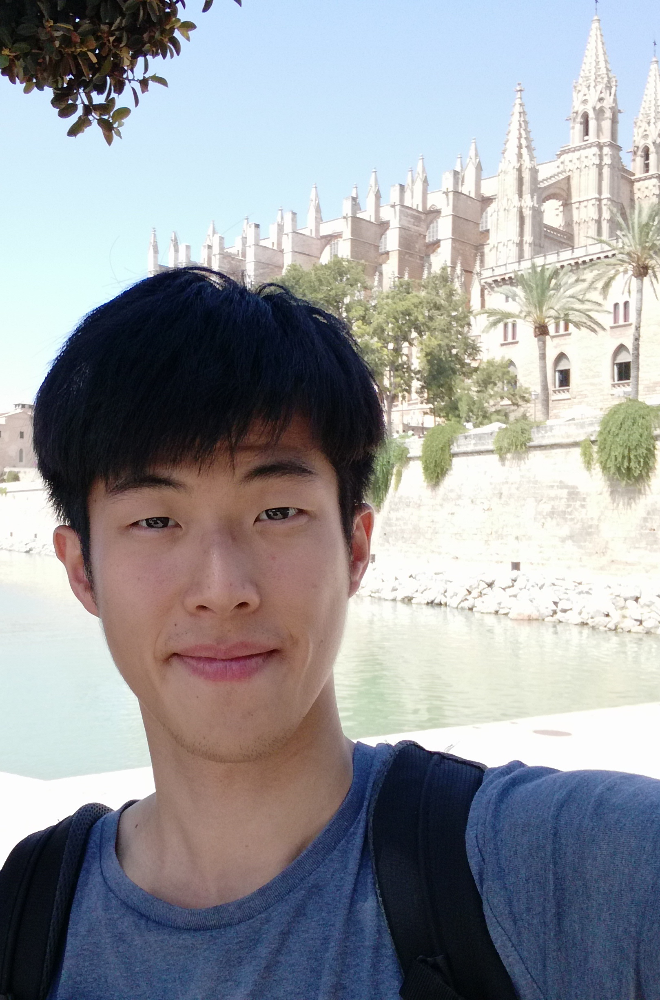

::: {.grid}
::: {.g-col-4}
{width=100%}
:::

::: {.g-col-8}
### Dr. Jen-Ping PENG{.mb-5}

<b>Current affiliation:</b> IMEDEA (UIB-CSIC) 
<b>Research group:</b> [Physical Ocean Processes](https://imedea-pop-lab.github.io/){.text-decoration-none}  
<b>Email:</b> jppeng (at) imedea.uib-csic.es 
<b>Address:</b> C/ Miquel Marquès, 21 
&nbsp;&nbsp;&nbsp;&nbsp;&nbsp;&nbsp;&nbsp;&nbsp;&nbsp;&nbsp;&nbsp;&nbsp;&nbsp;&nbsp;&nbsp;&nbsp;&nbsp;&nbsp;07190 Esporles 
&nbsp;&nbsp;&nbsp;&nbsp;&nbsp;&nbsp;&nbsp;&nbsp;&nbsp;&nbsp;&nbsp;&nbsp;&nbsp;&nbsp;&nbsp;&nbsp;&nbsp;&nbsp;Illes Balears, SPAIN 
<b>ORCID:</b> [0000-0003-1575-0165](https://orcid.org/0000-0003-1575-0165){.text-decoration-none}
:::
:::

## Overview

I am a Senior Postdoctoral Researcher at <b>the Mediterranean Institute for Advanced Studies (IMEDEA, UIB-CSIC)</b>, jointly affiliated with the Spanish National Research Council (CSIC) and the University of the Balearic Islands (UIB).

My academic trajectory spans leading research institutions in Germany, Australia, and Spain. My research focuses on the dynamics, instabilities, and turbulence of submesoscale fronts and filaments, and on their role in cross-scale energy transfer and air–sea fluxes under a wide range of atmospheric forcing conditions.

I address fundamental questions in physical oceanography using an integrated approach that combines theory, satellite and in-situ observations, and high-resolution numerical ocean and turbulence models.

## Research Interests
- Submesoscale dynamics
- Marine turbulence
- Cross-scale energy transfer
- Submesoscale air–sea interactions
- Oceanic extreme events (e.g., typhoons, freak waves)

## Recent News

- First Prize, [Outstanding Young Scientist Award (OYSA)](https://iwmo.net/iwmo-2026/)

- IWMO 2026 presentation, title: *Integration of SWOT and in situ observations into a high-resolution ocean data assimilation model for the 3D representation of a small-scale intrathermocline eddy*, 16th International Workshop on Modeling the Ocean, Palma, Balearic Islands, Spain, 2 to 5 June 2026.

- Ocean Sciences Meeting 2026 presentation, title: *Improving the representation of a small-scale intrathermocline eddy in a regional ocean model through SWOT and glider data assimilation*, Glasgow, Scotland, 22 to 27 February 2026.
